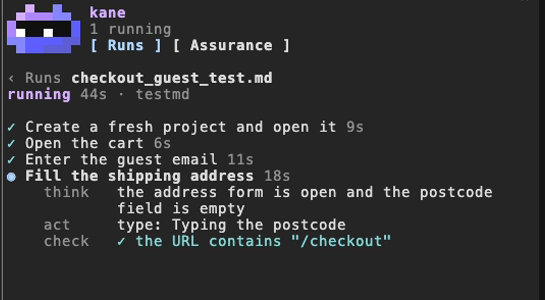
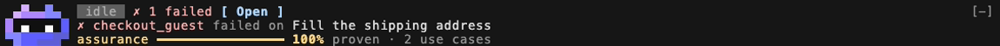
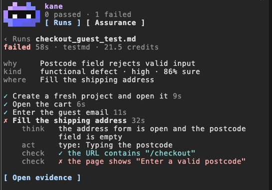
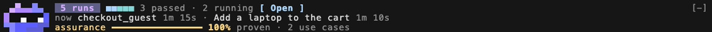
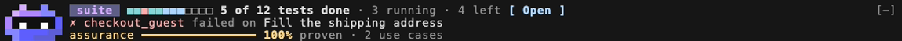
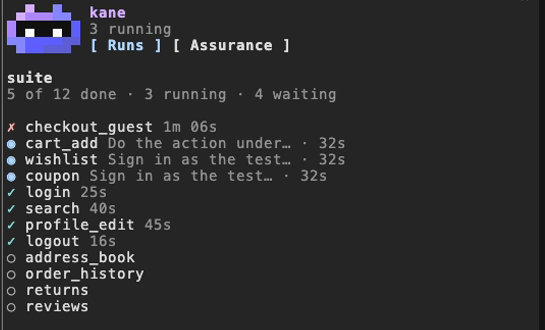
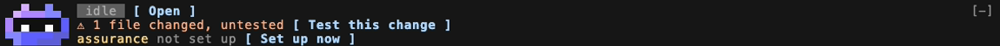
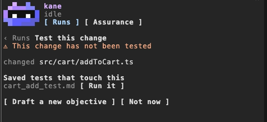
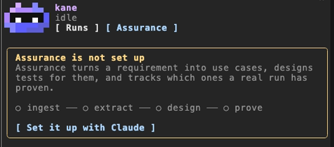

# kane-qe v2

A [Claude Code](https://claude.com/claude-code) mod that watches [kane-cli](https://github.com/LambdaTest/kane-cli) ([KaneAI](https://www.lambdatest.com/kane-ai)) and shows what it is doing, without being asked.

Claude runs kane-cli; the mod reads what kane-cli leaves on disk and draws it: a band of three rows above the prompt with the kane mascot, and a pane for runs and assurance. When Claude changes code and nothing has tested it, the band says so and offers a test.


**Read more:** the [Field Guide](https://claude.ai/artifact/Xp7W6L5sJQCm1tGB4w5TPo) (every band state, the pane, flows, use cases, guidelines and a chaptered walkthrough video recorded with real runs, also at [guide/kane-qe-v2-tour.mp4](guide/kane-qe-v2-tour.mp4)) · [Explained simply](https://claude.ai/artifact/H6DrA48p6UUnHCCdFErc9q) · [how v2 meets its design](guide/v2/design-coverage.md).

> v1, the cockpit that starts runs itself (Insights, Tests, History and Setup tabs, nine model tools), is on the [`main`](https://github.com/4DvAnCeBoY/kane-qe/tree/main) branch.

## Install

Requirements: Claude Code with mods (function-hook plugins), and kane-cli (`npm install -g @testmuai/kane-cli`, then `! kane-cli login --oauth` from the Claude prompt).

```
git clone -b v2 https://github.com/4DvAnCeBoY/kane-qe
claude --plugin-dir kane-qe/kane-qe
```

or add that folder to `env.CLAUDE_CODE_PLUGIN_DIRS` in `~/.claude/settings.json` to load it in every session. Once v2 is on `main`, `/plugin marketplace add 4DvAnCeBoY/kane-qe` and `/plugin install kane-qe@kane-qe` install it too.

## How to use it

Nothing to start. Open Claude Code in a project and the band is there. Everything below happens by itself.


**1. Ask Claude to test something:** "run `kane-cli run "Search for iPod and assert 4 products are listed" --url https://ecommerce-playground.lambdatest.io --agent --headless`", or "run the login test with kane-cli". Within two seconds the band shows the run: its name (taken from Claude's command), how long it has run, and the step it is on. The mascot's eyes move while it runs. A run you start yourself in a terminal in the same folder shows up the same way.

**2. Open the pane** with `/kane` or `[ Open ]`. Each run is a card; press its name for its steps. The step being worked on, or the one that failed, opens up to what the agent is thinking, the action it took and each check.



**3. When a test fails,** the band names it and the step it failed on, the moment it happens. The run's detail gives kane's own verdict: why, what kind of failure (category, severity, how sure kane is) and where. *Open evidence* asks Claude to open the run's evidence.





**4. Several runs, or a suite.** More than one run turns row 1 into a coloured cell per run with counts, and row 2 lists what is running now. A suite (`kane-cli testrun run`) shows one cell per test and *5 of 12 tests done · 3 running · 4 left*; a failure takes row 2 while the suite keeps going. In the pane a suite is one row per test.







**5. After Claude changes code.** When a turn ends with edited files (by the edit tools or by a shell command; docs, hidden tool folders like `.omc/` and git-ignored files don't count) and no kane-cli run since, row 2 warns *⚠ 1 file changed, untested* with *Test this change*. The card lists the changed files and the saved tests (`.testmuai/tests/*_test.md`) that mention the same feature, with their last result and *Run it*. When no saved test covers the change, Claude drafts an objective from the diff (or on *Draft a new objective*), and *Run the objective* hands it to Claude with the app's start URL. A kane-cli run that starts after the edit clears the warning, whatever its result.





`/kane auto` makes Claude test the change itself before it finishes its turn (held once per change). `/kane off` turns this off; `/kane ask` brings the button back.

**6. Assurance.** Row 3 is always requirement coverage from `kane-cli cover gaps --json`: *47% proven · 4 use cases*, or *82% designed · nothing run yet*. The Assurance tab has the designed and proven bars, the failing and blocked counts, when it last ran, and a card per use case with what it still owes. In a project without a requirement store it says so and offers *Set it up with Claude*.



## Commands and settings

| | |
|---|---|
| `/kane` | Open the pane |
| `/kane assurance` | Open the Assurance tab |
| `/kane auto` · `/kane ask` · `/kane off` | What happens after Claude changes code, for this session |

The colours follow Claude Code's theme: the design's palette on dark themes, a darker version of it on light ones.

`/config` → kane-qe: **After Claude changes code** (`offer` by default, `auto`, `off`) and **kane-cli command** (default `kane-cli`; used only for the read-only `cover gaps`).

## What it reads, and what it never does

- `~/.testmuai/kaneai/sessions/active/<pid>.json` once a second: only runs whose folder is inside this project, and only while their process is alive.
- Each run's `events.ndjson`, and each suite test's own stream, from where it last stopped. Structured lines only, never kane-cli's human output. Unknown events are skipped; lines that are not JSON are skipped and counted; a kane-cli whose wire format is newer than the mod shows the run's name and time and says so.
- Failure facts come from kane's verdict and nothing else. What kane-cli does not report is left out: no step totals, no credits while a run is going, no account balance.
- It never starts a kane-cli run. The only commands it runs are `kane-cli cover gaps --json`, `kill -0` to check a run is alive, and `git check-ignore` / `git diff` for the change card.

## Develop

| Path | What |
|---|---|
| `kane-qe/hooks/adapter.ts` | One kane-cli wire line → a small internal event: the only place raw field names appear |
| `kane-qe/hooks/model.ts` | Pure: events → runs, runs → the band's rows and the pane's text, cover gaps, change helpers |
| `kane-qe/hooks/sources.ts` | The live-run pointer and byte offsets into event files |
| `kane-qe/hooks/register.tsx` | Polling, hooks (edits, end of turn, `/kane`) and the drawing |
| `kane-qe/hooks/mascot.ts` | The mascot: a cell grid in terminals, an image elsewhere |
| `guide/` | The Field Guide and explainer pages, the walkthrough video and the script that records it (`KANE_DEMO_DIR=<project> guide/run_tour_v2.sh`), screenshots and the design coverage |
| `kane-qe/tests/` | Adapter table, band states at 60/80/120 columns, recorded kane-cli streams replayed, band and pane on terminal and desktop, change tracking, stale pointers, assurance |

```
claude plugin validate kane-qe
claude plugin test kane-qe
node kane-qe/tests/fixtures/build.mjs   # after recording a new kane-cli stream into tests/fixtures/
```

The screenshots are from a real Claude Code session in a terminal, with kane-cli runs staged on disk.

## License

[MIT](LICENSE)
